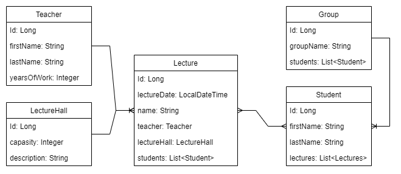

# University TT
- --
## How to start
- Clone this project to your IDEA
- Run the command in the IDEA console: `docker-compose up -d`
- After start program send POST request to the address `http://localhost:8080/inject-date/all` to add data to the DB
- - To see what will be added, check the class: 
`src/main/java/university/system/controller/InjectController.java`
- To view a list of student lectures send GET request to the address:
`http://localhost:8080/students?studentId={studentId}&lectureDate={lectureDate}`
- Data in format 'YYYY-MM-DD'
- --
## Diagram of relations between models

